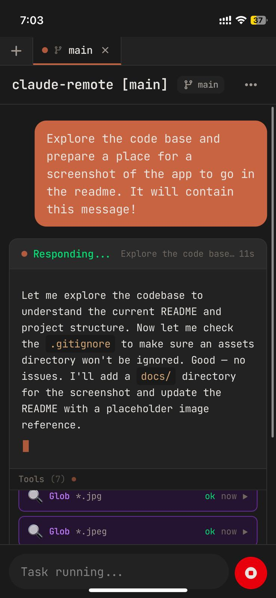

> [!NOTE]
> **This codebase was almost entirely written by Claude Code.** I ([Jamie](https://github.com/jamierpond)) designed the system architecture and directed development, but the vast majority of the code was generated by Claude while I operated it remotely from my phone — using this very app. Built by dogfooding.

# Claude Remote

A secure, mobile-first web interface for accessing [Claude Code](https://docs.anthropic.com/en/docs/agents-and-tools/claude-code/overview) from your phone.

Run Claude Code on your desktop or server, control it from anywhere over an encrypted connection.

<p align="center">
  
</p>

## Features

- **End-to-end encryption** — ECDH P-256 key exchange + AES-256-GCM per message
- **QR code pairing** — Scan once from your phone to pair
- **PIN protection** — Argon2-hashed, rate-limited authentication
- **Real-time streaming** — See Claude's responses as they're generated
- **Rich activity panel** — Live tool calls, file diffs, bash commands, sub-agent tasks
- **Multi-project support** — Switch between projects, git worktree support
- **Push notifications** — Get notified when Claude finishes a task
- **PWA support** — Install as a native-feeling app on your phone (see below)

## Install as a PWA (Recommended)

For the best experience, add Claude Remote to your home screen. This gives you a full-screen app experience with push notifications — no browser chrome, no tab clutter.

### iOS (Safari)

1. Open your Claude Remote URL in Safari
2. Tap the **Share** button (square with arrow)
3. Scroll down and tap **Add to Home Screen**
4. Tap **Add**

### Android (Chrome)

1. Open your Claude Remote URL in Chrome
2. Tap the **three-dot menu**
3. Tap **Add to Home screen** (or **Install app**)
4. Tap **Add**

Once installed, Claude Remote will launch as a standalone app with push notifications for completed tasks.

## Getting Started

### Prerequisites

- Node.js 20+
- pnpm
- [Claude CLI](https://docs.anthropic.com/en/docs/agents-and-tools/claude-code/overview) installed and authenticated
- An HTTPS reverse proxy (e.g. [Cloudflare Tunnel](https://developers.cloudflare.com/cloudflare-one/connections/connect-networks/), nginx, caddy)

### Installation

```bash
git clone https://github.com/jamierpond/claude-remote.git
cd claude-remote
pnpm install
```

### Configuration

Copy the example env file and fill in your values:

```bash
cp .env.example .env.local
```

```bash
# .env.local
CLAUDE_REMOTE_PIN=your-secure-pin
CLIENT_URL=https://your-client-domain.com
SERVER_URL=https://your-server-domain.com
```

### Running

```bash
# Development (hot reload)
pnpm dev

# Production
pnpm build
pnpm start
```

The server runs on port 6767 and serves the built client as static files.

### Systemd (Optional)

A systemd user service file is included for running as a daemon. Edit `claude-remote.service` to match your paths, then:

```bash
cp claude-remote.service ~/.config/systemd/user/
systemctl --user enable --now claude-remote
```

## How It Works

1. **Pair** — Server shows a QR code. Scan it from your phone to exchange ECDH keys.
2. **Authenticate** — Enter your PIN. It's verified against an argon2 hash on the server.
3. **Chat** — Messages are encrypted end-to-end. The server spawns Claude CLI and streams responses back.

All communication between your phone and the server is encrypted with a shared secret derived during pairing — even if your reverse proxy terminates TLS, the message contents are opaque.

## Architecture

- **Frontend**: React + TypeScript + Tailwind CSS (Vite)
- **Backend**: Node.js HTTP + WebSocket server
- **Security**: ECDH key exchange, AES-256-GCM encryption, argon2 PIN hashing
- **Claude**: Spawns `claude` CLI with `--output-format stream-json`

## License

[MIT](./LICENSE)
